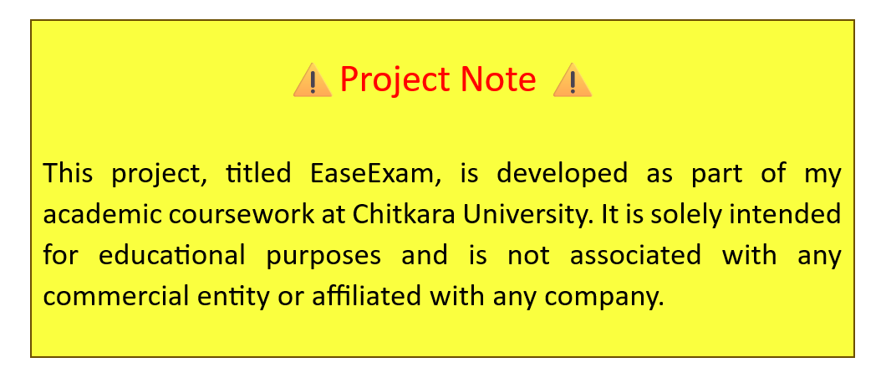

<div align="center">
  </img>
</div>


# Examease

Examease is a web-based platform designed for conducting exams online. It provides a user-friendly interface for both exam takers and administrators, facilitating the entire process from exam creation to result management.

## Features

- **User Authentication**: Secure login and authentication system for students and administrators.
- **Exam Creation**: Easy-to-use interface for creating exams with various question types.
- **Exam Management**: Edit, delete, and schedule exams as an administrator.
- **Real-time Monitoring**: Monitor live exams with updates on participant progress.
- **Scoring and Results**: Automatically score exams and provide instant results.
- **Analytics**: View detailed analytics and reports on exam performance.

## Getting Started

To run Examease , follow these steps:

- Go to
   ```bash
   https://examease.github.io
   ```
   
That's it! Examease doesn't require any additional installations or dependencies. Simply open `examease.github.io` in your browser, and you're ready to start using the platform.

## Usage

1. **Student View**: 
   - Login with your credentials.
   - Take exams assigned to you.
   - Submit your answers and view results.

2. **Administrator View**:
   - Login as an administrator.
   - Create new exams with questions.
   - Monitor live exams and view results.


## License

This project is licensed under the MIT License - see the [LICENSE](LICENCE) file for details.

## Contact

For any inquiries or feedback, please contact us at [Examease Support](mailto:prabhnoor2493.be23@chitkara.edu.in).

---
